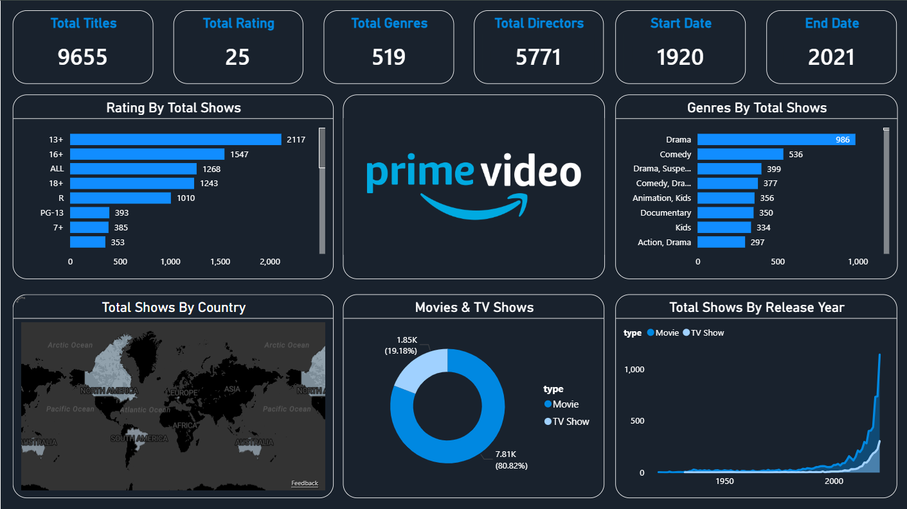

# 🎬 Amazon Prime Video Content Analytics Dashboard (Power BI)

~10,000 titles. 200M+ subscribers. One dashboard to make sense of it all.

This project is a **Power BI dashboard** built using an **Amazon Prime Video titles dataset (movies + TV shows, up to mid-2021)**.  
It transforms raw catalog metadata (cast, directors, ratings, release year, duration, genres, country) into **content-library insights** that are useful for content strategy, catalog planning, and analytics practice.

📌 Dashboard Preview

## 🧩 Context
Streaming platforms grow fast—and so does the content catalog. With thousands of titles across countries, genres, and maturity ratings, it becomes hard to answer simple questions quickly:
- What does the catalog look like overall?
- Which ratings dominate the platform?
- What genres are most common?
- How has the catalog grown over time?
- Which countries have more content availability?
- What’s the split between movies vs TV shows?

This dashboard organizes those answers into one clean report.

## 🎯 Objective
Build an interactive dashboard that helps:
- summarize the overall catalog (titles, genres, directors, year range),
- understand **ratings distribution**,
- identify **top genres**,
- compare **Movies vs TV Shows**,
- review **country-wise availability**,
- analyze **release-year trends** to understand catalog growth.

## ✅ What I Built
A single-page dashboard with KPI cards and analysis views:

### Key KPIs
- **Total Titles**
- **Total Ratings**
- **Total Genres**
- **Total Directors**
- **Start Date** and **End Date** (content timeline)

### Analysis Views
- **Rating by Total Shows** (maturity ratings distribution)
- **Genres by Total Shows** (top genres ranking)
- **Movies vs TV Shows** split (donut chart)
- **Total Shows by Country** (map view)
- **Total Shows by Release Year** (growth trend line)

## 🔧 How I Did It
1. Loaded the dataset into **Power BI**
2. Cleaned and prepared the data in **Power Query**
   - Standardized genre and rating fields
   - Handled nulls and formatting issues
   - Ensured correct data types (dates, text, numbers)
3. Created **DAX measures** for:
   - KPI totals (titles, genres, directors, ratings)
   - Ranking logic (top genres, rating counts)
   - Time-based trend measures (release year growth)
4. Designed a clean layout focused on fast discovery
   - Top KPIs first, then distribution/ranking, then geography and trend analysis

## 📈 Impact / Insights Enabled
This dashboard makes it easy to:
- Understand catalog scale and timeline at a glance
- See which maturity ratings dominate the platform
- Identify the most common genres and genre combinations
- Compare catalog mix between movies and TV shows
- Explore country-wise availability patterns
- Track catalog expansion trends across release years

## 🧠 Skills Used
- Power BI (dashboard design + modeling)
- Power Query (data cleaning & transformation)
- DAX (KPIs, ranking, and trend measures)
- Data storytelling (catalog insights in one view)
